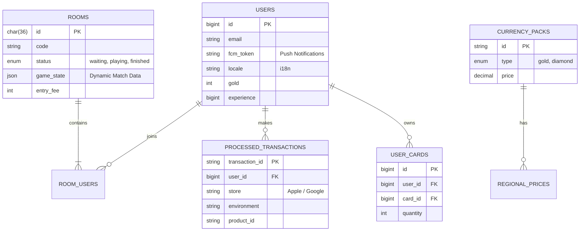

# Database Architecture & Relational Modeling

*Fools Gold* utilizes a strictly typed, fully relational database consisting of over 25 unique tables to ensure data integrity across complex game states, dynamic player inventories, and cross-platform monetization. 

While the current production environment utilizes MySQL, the schema strictly adheres to ACID compliance and advanced relational indexing, making the architecture 1-to-1 transferable to **PostgreSQL** environments (such as Supabase).

## 🗺️ Core Architecture (Simplified ERD)

## 🏗️ Engineering Highlights

### 1. Hybrid Relational & Document Data (State Management)
Turn-based multiplayer games require absolute state synchronization. 
* The `ROOMS` table utilizes a highly optimized `game_state` **JSON column** (conceptually identical to PostgreSQL `JSONB`).
* Instead of creating dozens of complex relational tables for ephemeral in-match data (like which player holds which specific temporary card during round 3), the entire match state is stored dynamically. This allows the backend to validate client states at lightning speed while keeping the core relational database clean.

### 2. Cross-Platform Monetization & IAP
The database is specifically modeled to handle mobile storefronts (iOS App Store & Google Play).
* **`processed_transactions`**: Acts as the source of truth for validated mobile purchases, preventing receipt-reuse attacks. It tracks the `store`, `environment` (Sandbox vs Production), and exact `product_id`.
* **`regional_prices`**: Decouples currency packs from strict USD, allowing localized dynamic pricing based on user regions.

### 3. Precision Economics & Data Types
In-game economy inflation requires strict data modeling to prevent overflow or floating-point inaccuracies.
* All lifetime accrual metrics (e.g., `total_gold_spent`, `total_diamonds_spent`) utilize `BIGINT`.
* As a strict UX rule, the game interface never uses abbreviated notations (e.g., "1.5K"). To support precise, full-number rendering on the frontend, all currencies are calculated and transmitted as exact integers, ensuring players always have perfectly accurate visibility of their balances.

### 4. Global Mobile Infrastructure
Subsequent database migrations have successfully scaled the user table to support a global mobile audience, incorporating `fcm_token` columns for native Firebase Push Notifications and `locale` strings for multi-language support across our web and native wrappers.
