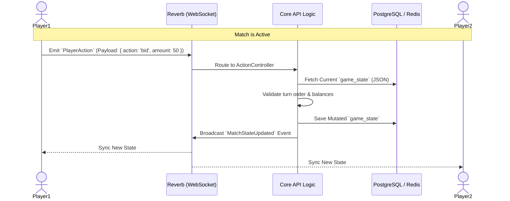

# Real-Time Architecture & WebSocket Communication

*Fools Gold* relies on a high-performance, event-driven real-time architecture to synchronize turn-based multiplayer matches. Powered by **Laravel Reverb** and backed by **Redis**, the system handles thousands of concurrent socket connections with sub-millisecond latency.

This infrastructure is conceptually identical to **Supabase Realtime** and strictly enforces structured, type-safe payload communication between the client and server, akin to **tRPC** principles.

## 🔄 Client-Server Communication Flow

## 📡 Core Event Dictionary

To maintain strict control over the game flow, clients never communicate directly with each other. All communication routes through the authoritative backend.

### 1. `MatchStateUpdated` (Server -> Client)
Fired whenever a valid action alters the game board. 
* **Payload:** Contains the newly mutated `game_state` JSON object.
* **State Management Handling:** On the frontend (Next.js/React Native), state managers (like Jotai/React Query) listen exclusively to this event to trigger UI re-renders. The frontend is entirely "dumb" and purely reflects the server's master state.

### 2. `PlayerAction` (Client -> Server)
Emitted by the client when the user attempts an action (e.g., bidding, passing, playing a bluff card).
* **Validation:** Payloads are strictly validated on arrival. If a payload violates expected types or game rules (e.g., trying to bid out of turn), the server rejects it silently or emits an `ActionRejected` error back to that specific socket.

### 3. `MatchmakingTick` (Server -> Client)
A specialized channel event that provides real-time updates regarding queue times and room availability before a game session is formally instantiated.

## 🏗️ Engineering Highlights

### 1. The Authoritative Server Pattern
Clients send *intents*, not *results*. A client sends `{ action: "use_item", item_id: 12 }`, and the server calculates the outcome. This strict boundary prevents memory manipulation and network-level cheating.

### 2. Queue Offloading for Socket Performance
Heavy computational tasks—such as calculating post-match MMR, distributing daily quest rewards, or writing exact `BIGINT` currency balance updates to the database—are decoupled from the WebSocket lifecycle. These tasks are dispatched to our dedicated **Redis Queue Worker**, ensuring the WebSocket server is never blocked by I/O operations and maintains maximum throughput.

### 3. Precision State Rendering
Because the game's UX strict guidelines prohibit currency abbreviations (e.g., "1.5K"), the WebSocket payloads always transmit absolute integer values. The frontend state management layer takes these exact figures and immediately updates the UI headers, ensuring zero desync between the visual representation and the backend's true state.
